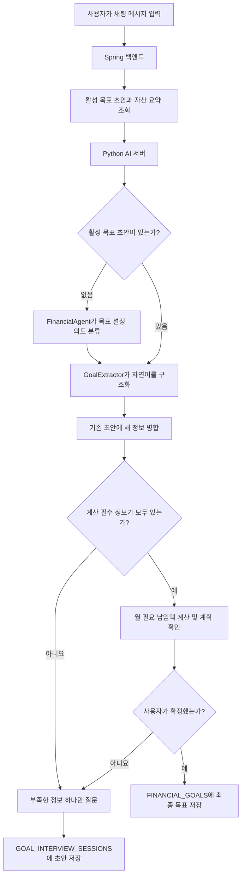

# 금융 목표 설정 기능 개발 현황

## 1. 문서 목적

이 문서는 이슈 `#67`에서 개발 중인 금융 목표 설정 기능의 배경, 현재 구조,
구현 범위와 남은 문제를 공유하기 위한 문서다.

목표는 사용자가 정해진 입력 폼이나 질문 순서에 맞추지 않아도 자연스럽게 말하면,
AI가 한 문장에서 여러 정보를 추출하고 부족한 내용만 이어서 질문하여 실행 가능한
금융 목표를 만드는 것이다.

예상하는 사용자 입력은 다음과 같다.

> 내년 11월까지 비상금 1,000만 원을 모으고 싶고, 현재 200만 원이 있으며
> 매달 50만 원씩 저축할 수 있어.

이 문장에서는 목표 유형, 목표 금액, 목표 시점, 현재 준비금과 월 납입 가능액을
한 번에 수집해야 한다. 이미 답한 내용을 다시 질문해서는 안 된다.

## 2. 개발을 시작한 이유

초기 구현은 현재 질문 필드에 해당하는 답만 해석하는 순차형 구조였다. 사용자가 한
문장에 여러 정보를 입력하거나 질문 순서와 다른 내용을 말하면 다음 문제가 발생했다.

- 이미 입력한 목표 금액이나 목표 종류를 다시 질문했다.
- `비상시에 사용할 1,000만 원`처럼 자연스러운 표현을 목표로 인식하지 못했다.
- `내년 11월`, `1년 뒤` 같은 상대 날짜를 안정적으로 처리하지 못했다.
- 목표 초안의 날짜가 배열로 직렬화되어 AI 서버에서 `422`가 발생했다.
- Groq 응답 형식 오류 시 같은 요청을 재호출하여 토큰 사용량이 빠르게 증가했다.
- Groq 일일 사용량 초과가 사용자에게는 일반 `502` 또는 `500` 오류로 보였다.

현재 구현은 고정된 질문 단계보다 **누적된 목표 초안과 이번 자연어 입력에서 확인된
정보**를 기준으로 다음 질문을 선택하는 방식으로 리팩터링하고 있다.

## 3. 현재 처리 흐름



새 목표의 첫 메시지는 일반 금융 대화인지 목표 설정 요청인지 구분하기 위한 모델 호출과
목표 정보 추출 호출이 각각 발생할 수 있다. 활성 목표 초안이 있는 후속 메시지는 의도
분류를 건너뛰고 목표 인터뷰로 바로 전달된다.

## 4. 수집하는 목표 정보

| 구분 | 필드 | 설명 | 현재 필수 여부 |
| --- | --- | --- | --- |
| 목표 식별 | `title`, `goalType` | 비상금, 여행, 주거, 교육 등의 목표 | 둘 중 목표를 식별할 정보 필요 |
| 계획 | `targetAmount` | 목표 금액 | 필수 |
| 계획 | `targetDate` | 목표 시점 | 필수 |
| 계획 | `currentAmount` | 해당 목표에 이미 배정한 금액 | 필수 |
| 계산 결과 | `requiredMonthlyAmount` | 목표일까지 매달 마련해야 하는 금액 | 백엔드 계산 |
| 맥락 | `motivation` | 목표가 필요한 이유 | 선택 |
| 맥락 | `priority` | 다른 목표 대비 중요도 | 선택 |
| 해석 기록 | `assumptions` | 상대 날짜 등을 해석한 기준 | 자동 기록 |

`motivation`과 `priority`는 대화를 풍부하게 만들 수 있지만 목표 달성 계산을 막는 필수
질문은 아니다. 따라서 현재 버전은 실행 계획을 빠르게 완성하는 데 우선순위를 둔다.

## 5. 구현된 기능

### 자연어 기반 목표 추출

- Groq Tool Calling으로 한 문장에서 여러 목표 필드를 동시에 추출한다.
- 기존 초안 전체와 기준일을 함께 전달해 사용자의 정정 사항을 누적 반영한다.
- 모델이 제안한 `nextField`는 실제로 비어 있는 필드일 때만 사용한다.
- 모델이 이미 채운 필드를 다시 질문하려 하면 애플리케이션이 다른 누락 필드를 선택한다.
- 비상금, 여행 등 대표 목표는 기본 제목을 자동 생성한다.

### 로컬 보조 해석

Groq가 `400`, `429`, 잘못된 Tool 응답 또는 검증 불가능한 데이터를 반환하면 같은 요청을
재호출하지 않는다. 즉시 로컬 규칙 기반 파서로 전환한다.

현재 로컬 파서는 다음 내용을 일부 인식한다.

- 금액: `1,000만 원`, `1.3억 원`, `백만 원` 등
- 목표: 비상금, 여행, 주거, 교육, 결혼, 부채 상환, 은퇴
- 날짜: `2027년 11월`, `내년 11월까지`, `올해 말`, `1년 뒤`, `18개월 후`
- 현재 준비금: `현재 200만 원`
- 우선순위: `최우선`, `우선순위가 높다/낮다`

로컬 파서에서도 정보를 얻지 못하면 추가 모델 호출 없이 현재 누락 필드에 대한 확인
질문을 반환한다.

### 상대 날짜 처리

- 기준일은 AI 서버가 요청을 처리하는 날짜다.
- `내년 11월까지`는 다음 해 11월 말로 해석한다.
- 연도가 없는 월은 아직 지나지 않았으면 올해, 이미 지났으면 다음 해로 해석한다.
- `까지`가 없는 월 단위 입력은 해당 월 1일로 해석한다.
- 해석 결과는 `assumptions`에 저장한다.
- Spring에서 Python으로 전달하는 `LocalDate`는 `YYYY-MM-DD` 문자열로 직렬화한다.

### 자산 정보 활용

- 백엔드가 현재 사용자의 계좌를 목표 자금 관점으로 요약해 AI 서버에 전달한다.
- 계좌 subtype은 `DEPOSIT`, `SAVINGS`, `STOCK`, `CMA`, `PENSION`, `LOAN`,
  `UNKNOWN`으로 표준화한다.
- 자금은 즉시 사용 가능, 조건 확인 필요, 위험 자산, 제외 자산 등으로 구분한다.
- 계좌 잔액을 목표 준비금으로 자동 확정하지 않고, 사용자에게 실제 배정 금액을 확인한다.

### 월 필요 납입액 계산

목표 정보가 모두 모이면 다음 값을 애플리케이션 코드로 계산한다.

- 남은 금액 = 목표 금액 - 현재 준비금
- 남은 개월 수 = 기준일에서 목표일까지의 개월 수
- 월 필요 납입액 = 남은 금액 / 남은 개월 수(올림)
- `requiredMonthlyAmount`는 AI가 아닌 Spring 백엔드가 계산하고 확정 시 다시 검증한다.
- 월 소득·지출 정보가 없으므로 현재 버전은 사용자의 실제 납입 가능 여부를 판정하지 않는다.

정상 계산 결과는 `CALCULATED`, 이미 준비금으로 달성한 경우는 `ALREADY_ACHIEVED`,
목표일이 지났거나 너무 가까운 경우는 `ADJUSTMENT_REQUIRED`로 구분하고 사용자에게
계획 확정을 요청한다.

### 목표 초안과 최종 목표 저장

- 진행 중인 초안은 `GOAL_INTERVIEW_SESSIONS.goal_draft_json`에 저장한다.
- 사용자와 대화방 조합당 활성 인터뷰는 하나만 유지한다.
- 사용자가 확정하면 `FINANCIAL_GOALS`에 최종 목표를 저장하고 세션을 `COMPLETED`로
  변경한다.
- 하나의 대화방에는 최종 금융 목표를 하나만 저장한다. 이미 목표가 확정된 대화방에서
  새 목표를 요청하면 목표 카드를 만들지 않고 새 대화방에서 설정하도록 안내한다.
- 사용자가 취소하면 세션을 `CANCELLED`로 변경한다.
- 동기와 우선순위는 선택 값이므로 DB에서도 `NULL`을 허용한다.

### Groq 사용량 초과 처리

- 목표 추출 실패 시 동일 요청을 재시도하지 않는다.
- Groq `429 RateLimitError`를 일반 `502`와 구분한다.
- Python AI 서버와 Spring 백엔드가 모두 HTTP `429`를 유지한다.
- 사용자에게는 내부 조직 ID나 토큰 사용량을 노출하지 않고 다음 메시지를 전달한다.

> 현재 AI 사용량 한도에 도달했습니다. 잠시 후 다시 시도해 주세요.

## 6. 현재 남아 있는 문제와 한계

### 모델 호출 비용

- 새 목표의 첫 입력은 의도 분류와 목표 추출로 모델을 두 번 호출할 수 있다.
- 목표 추출 출력 한도는 현재 `900` 토큰으로, 구조화 필드 수에 비해 더 줄일 여지가 있다.
- 대화 기록과 현재 초안이 길어질수록 입력 토큰도 증가한다.

향후 명백한 목표 문장은 로컬에서 먼저 감지하고, 필요한 경우에만 모델을 호출하는
하이브리드 라우팅을 검토한다.

### 로컬 파서의 제한

- `오십만 원` 같은 한글 수사와 단위 없는 `500000원`은 충분히 지원하지 않는다.
- 목표 유형과 지역명 키워드가 제한되어 있다.
- 복합 문장이나 부정 표현에서 금액의 역할을 잘못 구분할 수 있다.
- 로컬 파서는 장애 시 핵심 정보를 보존하기 위한 보조 수단이며 모델을 완전히 대체하지 않는다.

### 날짜 해석의 모호성

- `11월`만 입력하면 올해 또는 다음 해를 애플리케이션 규칙으로 결정한다.
- `내년 여름`, `연말쯤`, `두 달 반 뒤`와 같은 표현은 아직 안정적으로 지원하지 않는다.
- `assumptions`는 저장되지만, 모든 가정을 사용자에게 명시적으로 확인받는 UI는 없다.

금융 계획에서 날짜는 계산 결과에 직접 영향을 주므로, 모호한 날짜는 확정 전에 사용자에게
해석 결과를 보여주고 확인받는 단계가 필요하다.

### 심층 인터뷰 수준

현재는 목표 금액, 날짜, 준비금, 월 납입액을 빠르게 확보하는 데 초점을 맞췄다.
동기와 우선순위는 선택 값이므로 사용자가 말하지 않으면 질문하지 않고 목표가 완성될 수 있다.
처음 의도했던 심층 인터뷰를 구현하려면 목표 유형별 추가 질문 정책이 필요하다.

예를 들어 여행 목표에는 인원, 목적지, 예상 경비의 확정 여부를 질문할 수 있고,
비상금에는 월 필수생활비와 원하는 생활비 보장 개월 수를 질문할 수 있다. 다만 이러한 정보는
공통 필수 필드와 분리하여 불필요하게 긴 인터뷰가 되지 않도록 해야 한다.

### 자산과 목표의 연결

- 현재는 자산을 가용성별 합계로 참고하지만 특정 계좌를 목표에 직접 연결하지 않는다.
- `currentAmount`는 사용자가 실제로 목표에 배정했다고 확인한 금액이다.
- 한 계좌의 금액이 여러 목표의 준비금으로 중복 배정되는 것을 막는 구조가 아직 없다.
- 연금, 투자 자산, 만기 전 예·적금은 해지 비용과 유동성 조건을 더 정교하게 반영해야 한다.

향후 목표-계좌 배정 테이블이나 별도 배정 금액 모델이 필요하다.

### 데이터 무결성과 장애 복구

- 현재 목표 테이블은 로컬 DB별 외래 키 생성 문제를 피하기 위해 인덱스와 애플리케이션 검증을
  중심으로 구성되어 있다. 참조 무결성을 DB 외래 키로 강제할지는 스키마를 정리한 뒤 결정해야 한다.
- 사용자 메시지를 저장한 뒤 AI 호출이 실패하면 사용자 메시지만 남고 AI 답변이 없는 상태가
  생길 수 있다.
- AI 응답 성공 후 목표 초안 저장이 실패하는 경우의 재처리 정책이 없다.

메시지 저장, AI 호출, 목표 저장은 외부 호출이 포함되어 하나의 DB 트랜잭션만으로 해결하기
어렵다. 요청 상태 또는 idempotency key를 이용한 재처리 방식을 검토해야 한다.

## 7. 다음 개발 제안

1. 모호한 날짜를 확정 전에 보여주고 수정할 수 있게 한다.
2. 목표 유형별 선택 질문 정책을 추가해 심층 인터뷰 수준을 조절한다.
3. 로컬 선처리로 명백한 목표와 금액·날짜를 추출해 모델 호출량을 줄인다.
4. 목표-계좌 배정 모델을 추가하고 여러 목표 간 준비금 중복 배정을 방지한다.
5. AI 실패 후 사용자 메시지만 저장되는 문제에 대한 재시도 또는 상태 표시를 설계한다.
6. 실제 채팅 UI에서 시작, 후속 질문, 수정, 취소, 확정, 429 상황을 통합 테스트한다.

## 8. 확인용 대화 시나리오

### 한 문장에 모든 정보 입력

```text
사용자: 내년 11월까지 비상금 1,000만 원을 모으고 싶고,
        현재 200만 원이 있으며 매달 50만 원씩 저축할 수 있어.
예상: 이미 입력한 내용을 다시 묻지 않고 달성 가능성을 계산한 뒤 확정 여부를 질문한다.
```

### 부족한 정보만 후속 질문

```text
사용자: 가족과 유럽 여행을 가기 위해 1,300만 원을 모으고 싶어.
예상: 여행 목적과 목표 금액을 유지하고 목표 시점, 현재 준비금, 월 납입 가능액 중
      아직 확인되지 않은 항목을 질문한다.
```

### 상대 날짜와 정정

```text
사용자: 1년 뒤까지 500만 원을 모으고 싶어.
AI:     ...
사용자: 아니, 내년 11월 말까지로 바꿀게.
예상: 기존 목표의 날짜만 새 값으로 교체하고 다른 필드는 유지한다.
```

### 취소와 확정

```text
사용자: 그만할래.
예상: 활성 인터뷰를 CANCELLED로 변경한다.

사용자: 이대로 확정할게.
예상: 완성된 목표를 FINANCIAL_GOALS에 저장하고 인터뷰를 COMPLETED로 변경한다.

사용자: 새로운 여행 목표를 만들고 싶어.
예상: 해당 대화방에 이미 목표가 있으면 새 목표를 저장하지 않고 새 대화방에서 설정하도록 안내한다.
```

## 9. 주요 코드 위치

| 영역 | 위치 |
| --- | --- |
| 목표 상태 모델 | `ai/app/goals/interview/models.py` |
| 자연어 추출 및 로컬 보조 파서 | `ai/app/goals/interview/extractor.py` |
| 누락 필드 선택과 달성 가능성 계산 | `ai/app/goals/interview/service.py` |
| 목표 인터뷰 프롬프트 | `ai/app/goals/interview/prompts.py` |
| AI 채팅 진입 및 확정·취소 처리 | `ai/app/chat/service.py` |
| Groq 429 처리 | `ai/app/chat/router.py` |
| 자산 컨텍스트 생성 | `backend/src/main/java/com/wallo/asset/service/AssetService.java` |
| AI 서버 호출 | `backend/src/main/java/com/wallo/chat/client/PythonAiClient.java` |
| 대화와 목표 초안 연결 | `backend/src/main/java/com/wallo/chat/service/ConversationMessageService.java` |
| 목표 저장 | `backend/src/main/java/com/wallo/goal/service/GoalPersistenceService.java` |
| MyBatis 매퍼 | `backend/src/main/resources/mapper/goal/GoalMapper.xml` |
| 초기 DB 스키마 | `database/dbInit.sql` |
| 금융용어 초기 데이터 | `database/financial_term_data.sql` |

이 문서는 구현 상태가 변경될 때 완료 항목과 남은 문제를 함께 갱신한다.
