<div align="center">

# 💰 Wallo

**자산 연동부터 AI 금융 상담·목표 설계·소비 리포트·금융 챌린지까지,<br/>한 곳에서 관리하는 올인원 개인 금융 플랫폼**

[]()
[]()
[]()
[]()

</div>

<br/>

## 📌 목차

- [프로젝트 소개](#-프로젝트-소개)
- [주요 기능](#-주요-기능)
- [시스템 아키텍처](#-시스템-아키텍처)
- [기술 스택](#-기술-스택)
- [프로젝트 구조](#-프로젝트-구조)
- [데이터베이스 설계](#-데이터베이스-설계)
- [주요 플로우](#-주요-플로우)
- [API 연동](#-api-연동)
- [시작하기](#-시작하기)
- [환경 변수](#-환경-변수)
- [팀](#-팀)

<br/>

## 📝 프로젝트 소개

**Wallo**는 여러 금융기관에 흩어진 자산을 한 곳에 모으고, AI가 자산·소비 데이터를 분석해 맞춤형 조언을 제공하는 개인 금융 관리 서비스입니다.

정해진 입력 폼 대신 자연어 대화로 금융 목표를 설정하고, 실행 가능한 저축 계획을 받아볼 수 있습니다. 매일 수집되는 금융 뉴스는 AI가 자동으로 리포트를 생성하고 관련 금융용어를 함께 보여주며, 소비 습관 개선은 챌린지·미션 기반의 게이미피케이션으로 유도합니다.

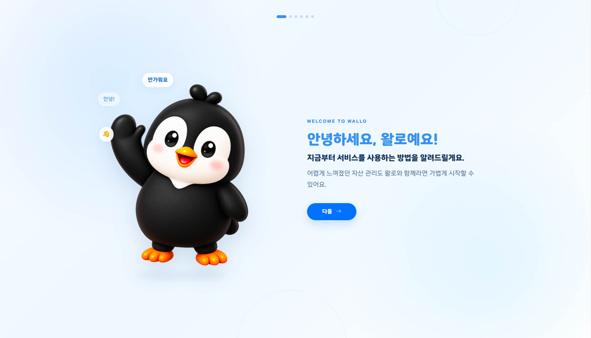

<br/>

## ✨ 주요 기능

### 🏦 자산 연동
- 마이데이터(Codef 연동) 기반 계좌·카드 자산 통합 조회
- 자산·소비 내역 자동 분류 및 소비 리포트 생성

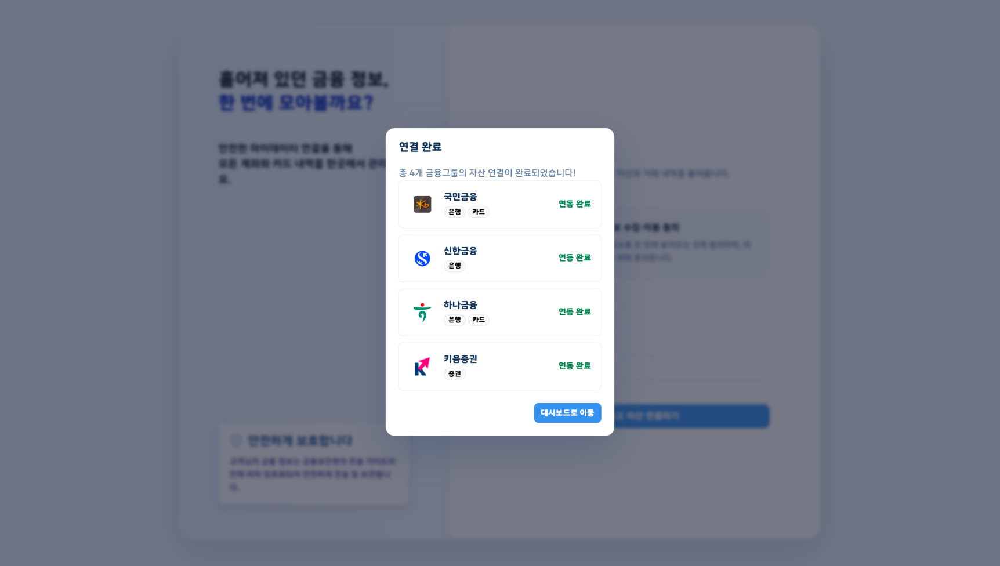

### 🤖 AI 금융 챗봇
- Groq 기반 LLM Tool Calling으로 자산 분석, 소비 코칭, 금융상품 추천 등 목적별 응답 생성
- 채팅 첫 대화 내용을 기반으로 채팅방 제목 자동 생성

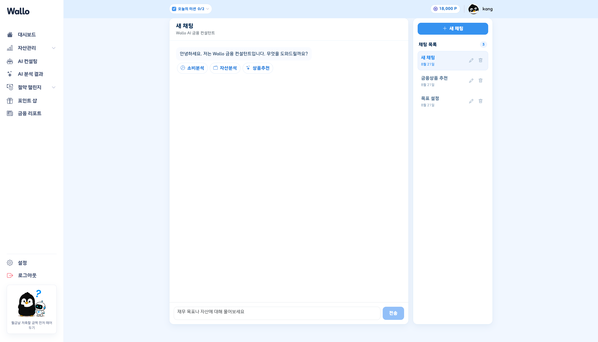

### 🎯 자연어 기반 금융 목표 설정
- 정해진 질문 순서 없이 자연어 한 문장에서 목표 금액·시점·현재 준비금 등을 한 번에 추출
- 부족한 정보만 이어서 질문하고, 목표일까지 필요한 월 납입액을 자동 계산
- Groq 응답 실패 시 로컬 규칙 기반 파서로 즉시 대체(불필요한 재호출 방지)

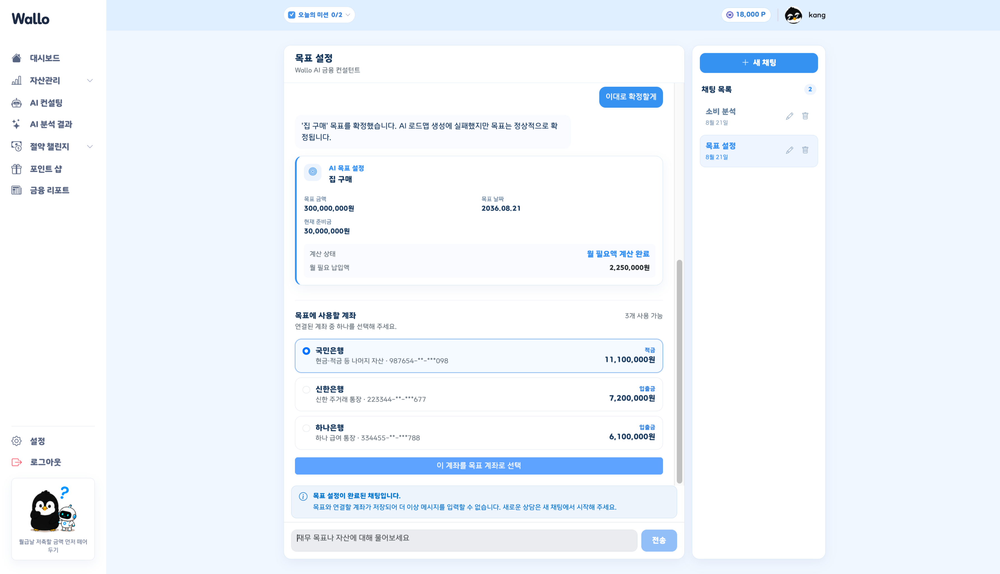

### 📰 금융 뉴스 리포트 & 금융용어 사전
- 뉴스 크롤링 → AI 리포트 생성 → 금융용어 매칭까지 자동 파이프라인(스케줄러 기반)
- 한국은행·금융감독원·재정경제부 용어사전(약 4,100건)을 기반으로 기사 속 금융용어를 자동 매칭
- 동일 뉴스라도 사용자 자산·소비 상황에 맞춰 영향도·대응전략을 개인화해서 별도 저장

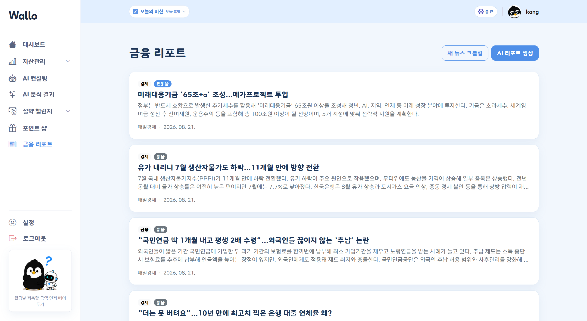

### 🏆 챌린지 & 미션
- 그룹/솔로 챌린지 생성 및 초대코드 참여, 절약 인증 피드 업로드
- AI 영상·이미지 분석으로 절약 여부·금액을 자동 판정하고, 사용자 피드백으로 결과를 검증·보정
- 인증 방식(AI 분석/거래내역/자가 체크)별 일일 미션과 포인트 적립, 포인트 상점
- 주간 랭킹(절약 금액·좋아요 수 기준)에 따라 순위별 포인트를 자동 지급

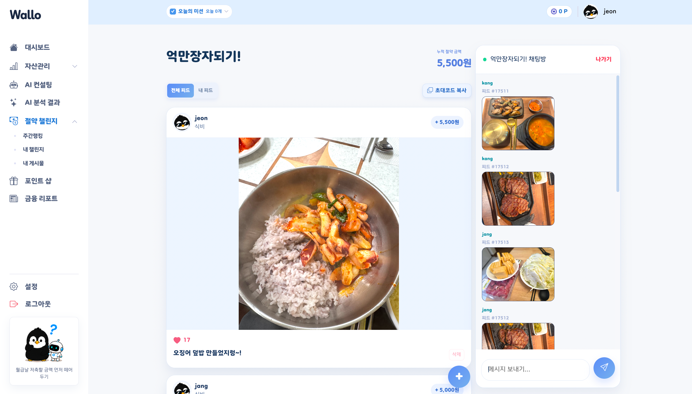

### 🛍️ 금융상품 추천
- 금융상품 정보 기반 AI 추천

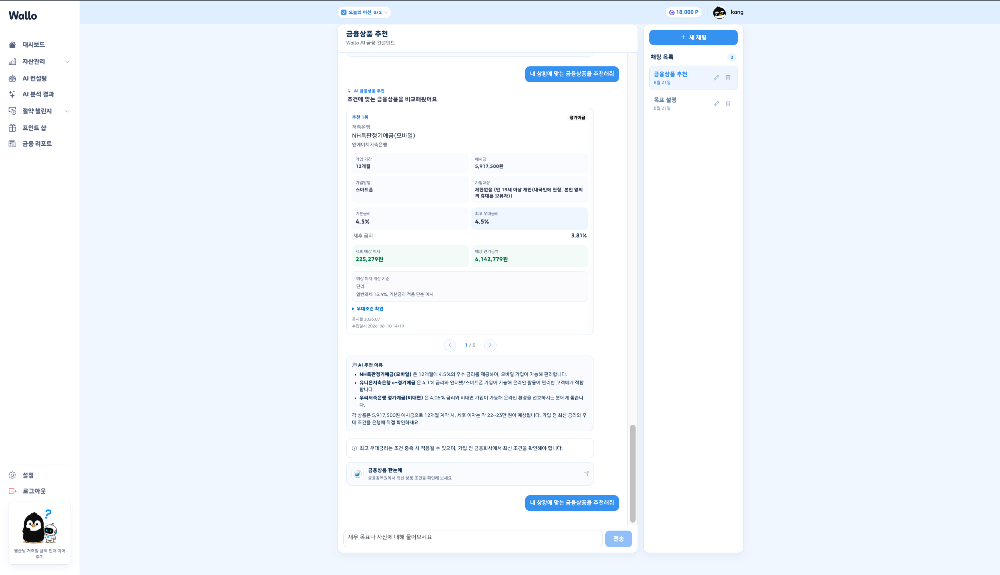

<br/>

## 🏗 시스템 아키텍처

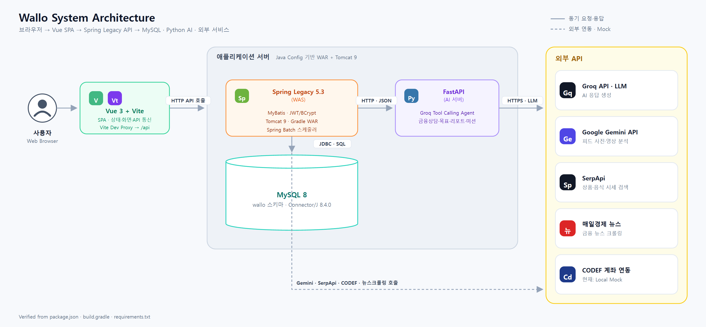

프론트엔드는 백엔드와만 통신하며, 백엔드가 AI 서버·외부 API·DB를 중계하는 구조입니다.

**아키텍처 원칙**
- **Spring Legacy 5.3 · Java Config** — Spring Boot 자동설정 없이 WAR로 빌드해 외부 Tomcat에 배포
- **JPA/Hibernate 미사용** — DB 접근은 MyBatis Mapper Interface + XML로만 처리
- **AI 서버와 데이터베이스 분리** — AI 서버는 DB에 직접 접근하지 않고, 백엔드가 필요한 컨텍스트만 HTTP·JSON으로 전달
- **외부 연동 상태 구분** — CODEF 계좌 연동은 현재 Local Mock API이며, 실연동은 별도 설정 필요

<br/>

## 🛠 기술 스택

### Frontend

| 분류 | 기술 |
| --- | --- |
| Framework | Vue 3 (Composition API, `<script setup>`) |
| Build Tool | Vite |
| State | Pinia |
| Styling | Bootstrap, Bootstrap Icons |
| HTTP | Axios |
| Chart | Chart.js, vue-chartjs |
| Test | Vitest, @vue/test-utils |

### Backend

| 분류 | 기술 |
| --- | --- |
| Language | Java 17 |
| Framework | Spring Framework 5.3.x (Legacy, Java Config 기반) |
| Persistence | MyBatis |
| DB Driver / Pool | MySQL Connector/J, HikariCP |
| Batch | Spring Batch |
| Crawling | Selenium |
| Docs | Springfox (Swagger2) |
| Build | Gradle (WAR) |
| Test | JUnit 5, Mockito, H2 |

### AI Server

| 분류 | 기술 |
| --- | --- |
| Framework | FastAPI, Uvicorn |
| LLM | Groq (Tool Calling 기반 Agent) |
| 기타 | 금융용어 크롤러/변환기(requests, BeautifulSoup, Selenium, pandas, PyMuPDF) |
| Test | pytest |

### Database & Infra

| 분류 | 기술 |
| --- | --- |
| DB | MySQL 8 |
| WAS | Tomcat 9 |

<br/>

## 📁 프로젝트 구조

```
Wallo/
├── frontend/                # Vue 3 클라이언트
│   └── src/
│       ├── api/             # Axios 인스턴스 및 API 모듈
│       ├── components/      # 재사용 컴포넌트
│       ├── composables/     # Composition API 훅
│       ├── features/        # 자산/금융 도메인 로직
│       ├── router/          # Vue Router 설정
│       ├── stores/          # Pinia 스토어
│       └── views/           # 페이지 컴포넌트
│           ├── ai/          # AI 챗봇
│           ├── analysis/    # 자산·소비 분석
│           ├── asset/       # 자산 연동
│           ├── auth/        # 로그인/인증
│           ├── challenge/   # 챌린지
│           ├── chat/        # 채팅
│           ├── dashboard/   # 대시보드
│           ├── onboarding/  # 온보딩
│           ├── product/     # 금융상품
│           ├── report/      # 금융 뉴스 리포트
│           └── user/        # 마이페이지
│
├── backend/                 # Spring Legacy 서버 (도메인 단위 패키지)
│   └── src/main/java/com/wallo/
│       ├── asset/           # 자산 연동·분류
│       ├── auth/            # 인증
│       ├── challenge/       # 챌린지
│       ├── chat/            # 채팅
│       ├── feed/            # 피드
│       ├── goal/            # 금융 목표
│       ├── mission/         # 미션
│       ├── pointshop/       # 포인트 상점
│       ├── report/          # 금융 뉴스 리포트
│       ├── user/            # 사용자
│       ├── external/        # 외부 API 연동
│       └── config/          # Java Config
│
├── ai/                       # FastAPI AI 서버 (기능 중심 패키지 구조)
│   ├── app/
│   │   ├── asset_reports/    # 소비 인사이트 API·Service·Agent
│   │   ├── category/         # 소비 카테고리 분류 API·Service·Agent
│   │   ├── chat/             # 금융 채팅 API와 응답 조합
│   │   ├── financial_assistant/ # 금융 대화 Agent와 Tool
│   │   │   └── tools/        # 자산 분석·소비 코칭·금융상품 추천 Tool
│   │   ├── goals/
│   │   │   ├── interview/    # 자연어 금융 목표 인터뷰
│   │   │   └── roadmap/      # 확정 목표 로드맵 생성
│   │   ├── missions/         # 개인화 미션 생성 API
│   │   ├── reports/          # 금융 뉴스 리포트 생성 API
│   │   ├── health/           # AI 서버 상태 확인 API
│   │   ├── clients/          # Groq 클라이언트
│   │   └── core/             # 환경설정·토큰 가드·AI 요청 측정
│   ├── data/                 # 금융상품·금융용어 원본 및 가공 데이터
│   ├── scripts/              # 금융 데이터 수집·변환 스크립트
│   └── tests/                # AI 서버 pytest 테스트
│
└── database/                 # 스키마·시드 SQL
    ├── sql/
    └── seed/
```

<br/>

## 🗄 데이터베이스 설계

기능 도메인별로 테이블을 묶어서 본 개요입니다(발표용 요약이며, 도메인 간 연결선은 생략했습니다).

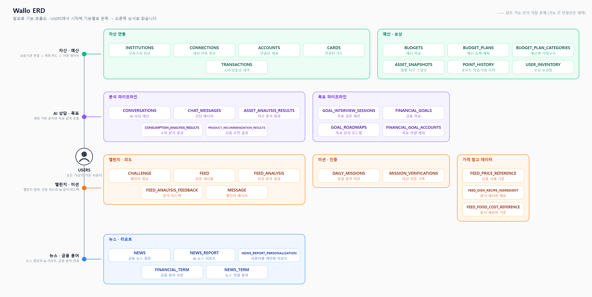

<br/>

## 📋 주요 플로우

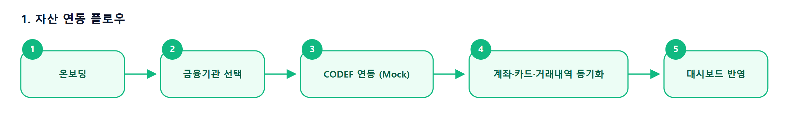

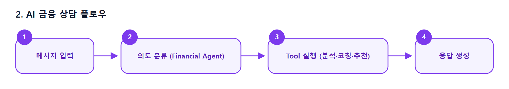

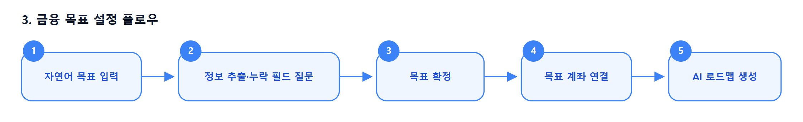

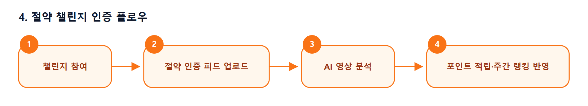

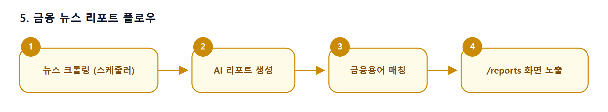

<br/>

## 🌐 API 연동

총 **87개 REST API**와 **WebSocket 1개**(챌린지 실시간 채팅)로 구성되어 있습니다. 전체 요청/응답 명세는 팀 API 명세서를 참고하거나, 백엔드 실행 후 Swagger UI(`http://localhost:8080/swagger-ui/`)에서 확인할 수 있습니다.

### 도메인별 구성

| 도메인 | 개수 | 설명 |
| --- | --- | --- |
| 인증 | 5 | 회원가입, 로그인/로그아웃, 토큰 재발급, 내 정보 조회 |
| 사용자 · 프로필 | 7 | 프로필 조회/수정, 비밀번호 변경, 프로필 이미지, 연봉 정보 |
| 자산 · 예산 · 연동 | 12 | 자산 통합 조회, 소비 내역, 예산 설정, 금융기관 연동 |
| AI 금융 상담 | 8 | 채팅, 대화방 관리, 메시지, 목표 인터뷰 조회 |
| 금융 목표 | 7 | 목표 조회/요약, 목표 계좌 선택, 로드맵 조회·진행 |
| 챌린지 · 피드 · 미션 | 22 | 챌린지 생성/참여, 랭킹, 피드 업로드/분석, 일일 미션 인증 |
| 리포트 · 소비 인사이트 | 10 | 소비 인사이트, 세금정산, 뉴스 리포트 생성/조회, 크롤링 테스트 |
| 포인트 상점 | 7 | 상점 조회, 박스 뽑기, 포인트 내역, 인벤토리 |
| 상품추천 · CODEF 연동 | 9 | 금융상품 추천, CODEF Mock API(계좌·카드·증권·거래내역·소득증명) |

### 대표 엔드포인트

| Method | Endpoint | 설명 |
| --- | --- | --- |
| POST | `/api/auth/login` | 로그인, accessToken 발급 + refresh 토큰 쿠키 설정 |
| GET | `/api/assets` | 계좌·카드·증권 통합 자산 조회 |
| POST | `/api/connections` | 선택한 금융기관 전체 자산 연동(CODEF) |
| POST | `/api/chat` | AI 금융 챗봇 메시지 전송 |
| POST | `/api/conversations/{conversationId}/messages` | 대화방에 메시지 전송(목표 인터뷰 포함) |
| GET | `/api/goals/{goalId}/roadmap` | AI 목표 로드맵 조회 |
| POST | `/api/challenges/{challengeId}/feeds` | 절약 인증 피드 업로드(AI 분석 포함) |
| GET | `/api/challenges/rankings/weekly` | 챌린지 주간 랭킹 조회 |
| POST | `/api/missions/{dailyMissionId}/verify` | AI 기반 일일 미션 인증 |
| GET | `/api/reports` | 금융 뉴스 리포트 목록 조회 |
| GET | `/api/product-recommendations/latest` | 최근 금융상품 추천 결과 조회 |
| WS | `/ws/challenges/{challengeId}` | 챌린지 실시간 채팅 메시지(WebSocket) |

### 공통 규칙

- **인증**: `Authorization: Bearer {accessToken}` 헤더 사용, refresh token은 `WALLO_REFRESH_TOKEN` HttpOnly 쿠키로 관리
- **응답 형식**: 대부분의 API는 `CommonResponse{success, data, error{code, message}}` 구조로 응답
- **날짜/시간**: ISO 형식 직렬화(JavaTimeModule)
- **WebSocket**: `/ws/challenges/{challengeId}`는 handshake 시 `accessToken`을 쿼리 파라미터로 전달해 인증

<br/>

## 🚀 시작하기

### 요구 사항

- Node.js 18+, npm
- JDK 17, Tomcat 9
- Python 3.x
- MySQL 8

### 1. 데이터베이스 준비

```bash
mysql -u root -p < database/dbinit.sql
mysql -u root -p wallo < ai/data/processed/financial_term_insert.sql
```

`backend/src/main/resources/application-local.properties`를 생성해 로컬 DB 비밀번호 등을 설정합니다(커밋 대상 아님).

### 2. AI 서버 실행

```bash
cd ai
python -m venv .venv
.venv\Scripts\activate        # Windows
pip install -r requirements.txt
cp .env.example .env          # GROQ_API_KEY 입력
uvicorn app.application:app --reload --port 8000
```

### 3. 백엔드 실행

Spring Boot가 아닌 WAR + 외부 Tomcat 구조로, IntelliJ의 Tomcat Server(Local) 실행 구성을 권장합니다. 수동 빌드 시:

```bash
cd backend
./gradlew build
# backend/build/libs/*.war 를 Tomcat 9의 webapps/ 에 배치
```

### 4. 프론트엔드 실행

```bash
cd frontend
npm install
npm run dev
```

`http://localhost:5173` 접속 (API 요청은 Vite 프록시를 통해 `http://localhost:8080`으로 전달됩니다.)

더 자세한 실행·트러블슈팅 가이드는 [RUNBOOK.md](RUNBOOK.md)를 참고하세요.

<br/>

## 🔑 환경 변수

| 위치 | 파일 | 용도 |
| --- | --- | --- |
| Backend | `application-local.properties` | DB 접속 정보 등 로컬 값(git 추적 제외) |
| AI Server | `ai/.env` (`ai/.env.example` 참고) | `GROQ_API_KEY`, `GROQ_MODEL`, `AI_REPORT_MOCK_ENABLED` 등 |

> ⚠️ 실제 API 키·비밀번호는 절대 커밋하지 마세요.

<br/>

## 👥 팀

<!-- 팀원 정보를 입력하세요 -->

| 이름 | 역할 | GitHub |
| --- | --- | --- |
|  |  |  |
|  |  |  |
|  |  |  |
